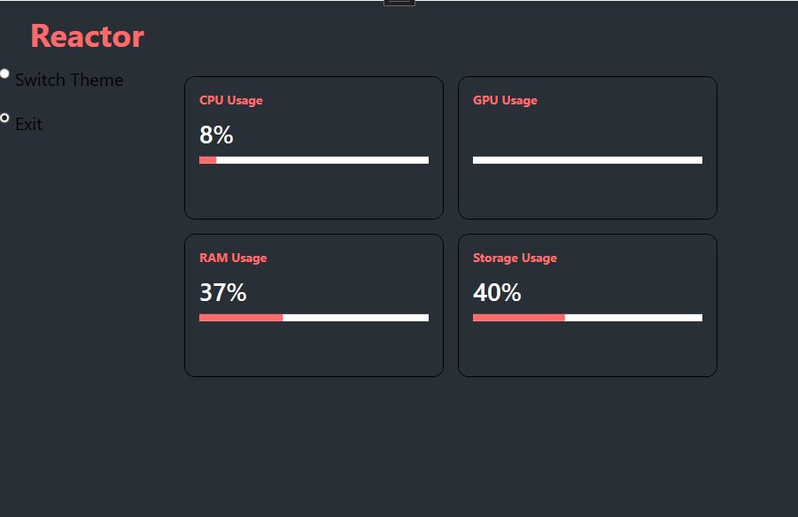

⚡ Reactor – A Simple, Clean System Monitor

Reactor is a lightweight system monitoring app for Windows, inspired by the elegant UI and functional approach of NZXT CAM. This project was built to offer real-time insights into your system's core performance metrics—CPU, RAM, and storage—within a clean and modern interface.
🚀 Features

    CPU Monitoring
    See real-time CPU usage, core count, and processor name.

    RAM Monitoring
    Track total and used memory with live updates.

    Storage Info
    View all drives and their usage statistics in a sleek display.

    (GPU Monitoring coming soon)

💡 Inspiration

I’ve always liked the aesthetic and utility of NZXT CAM, but wanted something custom and more lightweight. Reactor was born from that idea—a project focused on simplicity, clarity, and performance.

🛠️ Tech Stack

    .NET (WPF)

    MVVM Architecture

    C#

    DispatcherTimers for live updates

    INotifyPropertyChanged for real-time UI binding# Reactor

    

    
    ⚙️ Installation

    Clone the repository
    git clone https://github.com/yourusername/Reactor.git

    Open in Visual Studio

    Build and run the solution

No installer needed—Reactor runs directly as a standalone WPF app.

📌 TODO / Roadmap

GPU Usage support

Temperature monitoring

Dark/Light mode switch

Compact mode UI

Installer packaging

🧠 Learnings

This project was a hands-on deep dive into WPF data binding, MVVM architecture, and performance optimization using DispatcherTimer. It was also a fun UI/UX challenge to keep things clean and readable like CAM.

🧑‍💻 Author

Made by Craig Joiner ☕💻
Feel free to fork or contribute!

